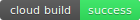
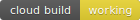
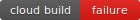
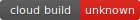

# badger


badger generates build status images based on [Cloud Build](https://cloud.google.com/cloud-build) status info.

## Usage

The badger service must be [hosted in your own Google Cloud project](#install) with permission to read build status information from the Cloud Build API. Once the badger service is deployed you need construct an image URL that you can use in your `README.md`

The badger service requires a valid project id and trigger id as input and returns the latest build status for the given trigger id. Retrieve your project id:

```
PROJECT_ID=$(gcloud config get-value project)
```

Retrieve the trigger id associated with your build pipeline:  

```
TRIGGER_NAME="badger"
```

```
TRIGGER_ID=$(gcloud beta builds triggers describe ${TRIGGER_NAME} --format='value(id)')
```

Retrieve the service URL associated with your `badger` deployment:

```
BADGER_ENDPOINT=$(gcloud run services describe badger \
  --platform managed \
  --region us-east1 \
  --format 'value(status.url)')
```

Construct an image URL using the badger service URL, trigger id, and project id. [Example](https://badger-6bn2iswfgq-ue.a.run.app/build/status?project=hightowerlabs&id=1c96a91a-bb98-49d8-b43a-c76173a13ff8):

```
https://badger-6bn2iswfgq-ue.a.run.app/build/status?project=hightowerlabs&id=1c96a91a-bb98-49d8-b43a-c76173a13ff8 
```

### Add Build Status To README Files

Use the following [markdown syntax](https://guides.github.com/features/mastering-markdown/) to display build status images in your README files. In the following example the project id is `hightowerlabs` and the trigger id is `1c96a91a-bb98-49d8-b43a-c76173a13ff8`.

```

```


## Install

This section will walk you through deploying the badger service to [Cloud Run](https://cloud.google.com/run).

Retrieve your Google Cloud project ID.

```
PROJECT_ID=$(gcloud config get-value project)
```

Create a `badger` service account and grant it the `roles/cloudbuild.builds.viewer` IAM role.

```
gcloud iam service-accounts create badger
```

```
gcloud projects add-iam-policy-binding ${PROJECT_ID} \
  --member serviceAccount:badger@${PROJECT_ID}.iam.gserviceaccount.com \
  --role roles/cloudbuild.builds.viewer
```

Deploy the `gcr.io/hightowerlabs/badger:0.0.1` container to Cloud Run.

```
gcloud run deploy badger \
  --allow-unauthenticated \
  --service-account "badger@${PROJECT_ID}.iam.gserviceaccount.com" \
  --concurrency 80 \
  --cpu 1 \
  --image gcr.io/hightowerlabs/badger:0.0.1 \
  --memory '128Mi' \
  --platform managed \
  --region us-east1
```

### Test the Installation

Retrieve the badger Cloud Run service url:

```
BADGER_ENDPOINT=$(gcloud run services describe badger \
  --platform managed \
  --region us-east1 \
  --format 'value(status.url)')
```

Use `curl` to get the test build status badges: 

```
curl ${BADGER_ENDPOINT}/test/build/status -d 'project=test' -d 'id=success'
curl ${BADGER_ENDPOINT}/test/build/status -d 'project=test' -d 'id=working'
curl ${BADGER_ENDPOINT}/test/build/status -d 'project=test' -d 'id=failure'
curl ${BADGER_ENDPOINT}/test/build/status -d 'project=test' -d 'id=unknown'
```

   


